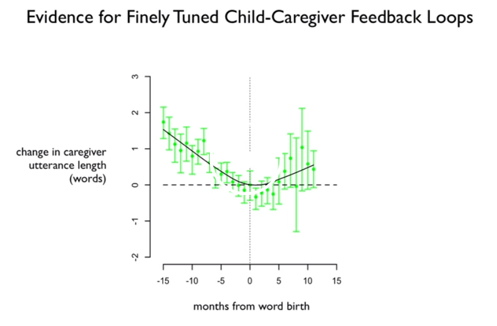
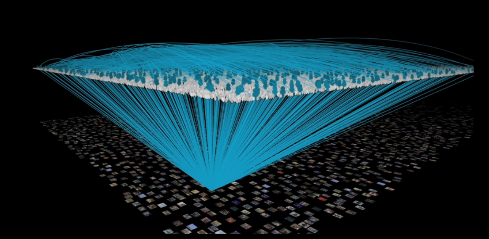

### Overview

Deb Roy’s fascinating TED talk explores how infants learn language by utilizing big data visualization and analytics. If you haven't seen it already, take 20 minutes and [watch it now][1]. By placing a camera and microphone in each room of his house, Roy collected 90,000 hours of video and 140,000 hours of audio over the course of the first three year’s of his son’s life. Delving into this massive data set, Roy and his MIT research team utilized audio and motion analysis to visualize language development. Later, Roy applies these same analysis techniques to mass media which provides a unique look on the media’s influence on social networks.

### Analytical Scope

Roy states his overall goal as, ”use natural longitudinal data to understand the process of how a child learns language.” Measure the influence of social environments on language acquisition, using analysis techniques including:
- Motion analysis to create ”space-time worms” and ”social hotspots.” These animations offer a look into the physical locations where social interactions take place.
- Automated speech transcription to track the location and frequency of words and phrases. Parsing these transcripts allows one to isolate a certain word or phrase and listen to its development over time.
- 3-D Data Visualization and Animation
	- Evidence for Finely Tuned Child-Caregiver Feedback loops
	- Language Context Map - ”Wordscapes”
	- Social Network and Mass Media Relationships

### Results

There are incredible feedback loops, some subconscious, that affect how we speak and how chil- dren learn language. Roy discovered a correlation between the average length of the utterance containing a word, and the time at which it came part of a child’s vocabulary. The graph below illustrates the correlation:

 The point at which the length of the utterance approached 0 matched up almost precisely to the point in time at which the child began using the word. It seems to point to the idea that caregivers will subconsciously reduce a word to its simplest form, allow the child to ”latch” on to it, and then slowly ramp up the complexity of the context in which it is used.

Similarly, the ”wordscapes” produced using motion tracking show how location affects lan- guage development. Words like ”water” and ”food” occur most frequently in the kitchen, while ”bye” was learned in the hallway near the front door.

The mass media application produced stunning visualization results. By utilizing a 3D, multi-planar visual, Roy is able to illustrate how certain ”Pro-Am” tweeters influence social networks regarding television, and conversely, how television generates activity among social networks (visualizing President Obama’s State of the Union Address provides the most telling example, shown below).

Roy concludes by explaining how increasingly instrumented our world is. Sensors every- where, capable of collecting and producing titanic amounts of data everyday. Connecting the dots between what’s said and the context it was said in – ”making links between commentary 2 and content” – gives us a more intimate understand into how social environments affect our communication habits.

### Future Extensions of this work

##### Television Engagement Analysis
Roy’s visualization techniques could be used to help screenwriters identify which sections of their script has the most impact on viewers. Writers and producers could easily develop and test hypothesis by analyzing past episodes and the related social media mentions of their show.

##### Health Care - Improve Patient Interaction
Utilizing the speech transcription feature of Roy’s research, hospitals could monitor which words or phrases correlate to the best patient mood. If they developed both a metric for gauging patient response to interaction, they could quickly test different phrases or deliveries of medical updates or instructions to the patient, measuring which delivery yields the highest agreement/compliance metric.

##### Twitter’s Impact on Politics
The is more of a ”past” extension, but a very similar project and research goal: [”Social Media as a Quantitative Indicator of Political Behavior”][2]. The researches analyzed over 500,000 tweets from 795 competitive races spanning the 2010 and 2012 congressional elections. One of their key findings: the more tweets you get, the more votes you get.

[1]: https://www.ted.com/talks/deb_roy_the_birth_of_a_word?language=en
[2]: http://brenocon.com/tweet_share_elex_analysis_of_digrazia/SSRN-id2235423.pdf
