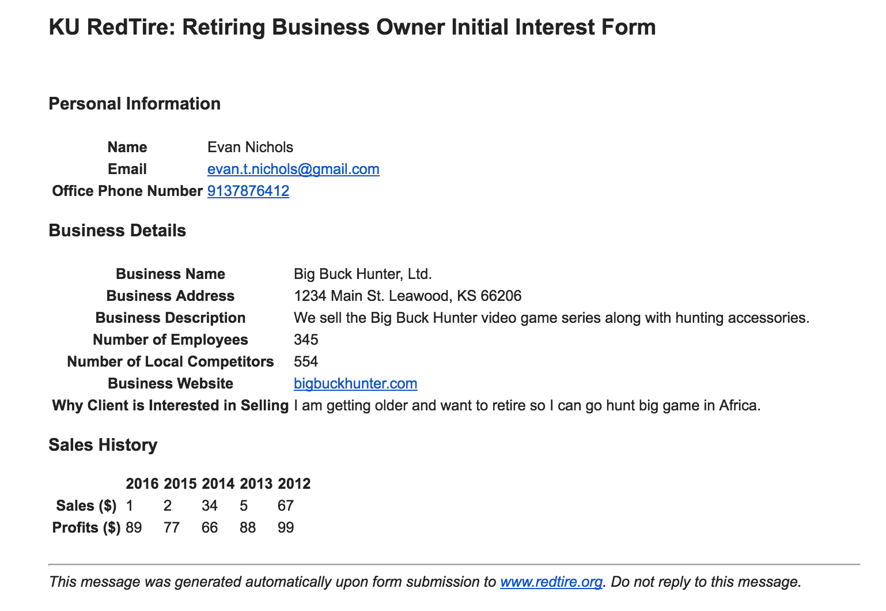

[KU RedTire][7] is a business owner successor program with the goal of matching retiring Kansas business owners University of Kansas graduates and alums who have the expertise and ambition to run those businesses. The company is run by Denton Zeeman and Wally Meyer, two KU Business School Professors. Heavily involved in the [KU Catalyst Program][1], Wally has served as an incredible mentor to me these past two years. Wally wanted simplify the application process for retiring and aspiring business owners. The Redtire website previously had only PDF versions of the two forms available to applicants, which they would have to download, fill out, scan and then resubmit via email. I set out to convert the PDFs into responsive online forms.

I used [Bootstrap][2] to create the forms, paired with the Google Font [Roboto][3]. I used PHP scripts to build HTML email messages from the form submissions, making use of the handy [PHPMailer][4] library. The aspiring business owner application form includes a 30 question survey, so I made use of a few simple "factory" functions to create headers and table row elements.

```php
function headerFactory($header=''){
    return "<h3><b>".$header."</b></h3>";
};

function createSalesTableRow($field='', $val1='', $val2='', $val3='',$val4='',$val5=''){
    return "<tr><th>".$field."</th><td>".$val1."</td><td>".$val2."</td><td>".$val3."</td><td>".$val4."</td><td>".$val5."</td></tr>";
};
```

Mac OS X Yosemite and Mac OS X El Capitan both come with Apache 2.4 preinstalled, which I used for local development and script testing. I used Gmail's smtp via PHPMailer since I didn't have access/credentials to the KU email servers during development. [This tutorial][5] was very helpful with getting PHP configured correctly. Note: If you plan on using Gmail's smtp with PHPMailer in the future, save yourself an error message and make sure to generate an [application specific password][6] for use in your scripts.

Here's an example message produced by the scripts, for the Retiring Business Owner Initial Interest Form:



The messages are formatted to be copy and pasted directly into a spreadsheet. I really enjoyed working on this project -- it was one that I saw from idea to actual deployment live on the [KU Redtire site][7], with help from the Chris Welchhans, the KU Business School's Web Developer.

[1]: https://catalyst.ku.edu/
[2]: http://getbootstrap.com/
[3]: https://www.google.com/fonts/specimen/Roboto
[4]: https://github.com/PHPMailer/PHPMailer
[5]: https://coolestguidesontheplanet.com/get-apache-mysql-php-and-phpmyadmin-working-on-osx-10-11-el-capitan/
[6]: https://support.google.com/accounts/answer/185833?hl=en
[7]: http://redtire.dept.ku.edu/
