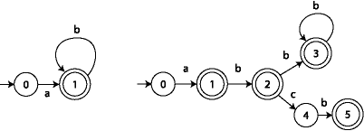
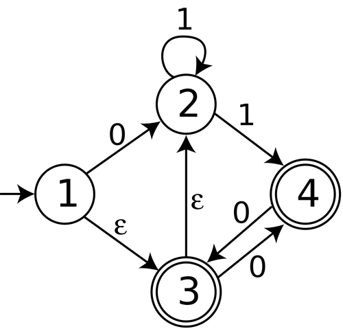
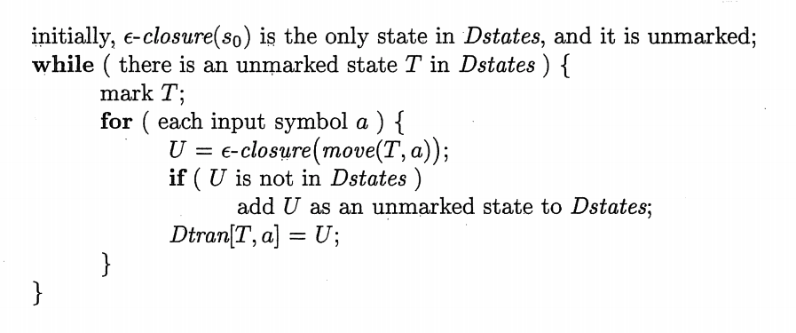

### Overview
I completed this project as part of my coursework for EECS 665, a Compilers course taught by Prasad Kulkarni. The program takes in a text representation of a [Nondeterministic Finite Automaton (NFA)](https://en.wikipedia.org/wiki/Nondeterministic_finite_automaton) (read: a simple state machine) and converts it into a [Deterministic Finite Automaton (DFA)](https://en.wikipedia.org/wiki/Deterministic_finite_automaton).

Quick Finite State machine recap: they're simple machines capable of representing regular expressions, and some more complicated things, too. They look like this:



It's a series of states with different "transition moves" defined to travel in between them. States can also loop on themselves, like we see with the 'b' moves in the machines above.

Notice the states with double rings: these are called the "final states." They are a spot where the machine can stop producing/consuming input and safely stop.

Now for the distinction: compare the machines above with this one:



Notice the differences: there are some epsilon-transitions (or "ε-transitions"), and states can do multiple actions with the same symbol! This is the main distinction between DFAs and NFAs, as their name implies: *Deterministic* machines have at most one move defined for each alphabet symbol, and do not allow for ε-transitions. *Nondeterministic* machines on the other hand, can break both of those rules.

An interesting fact, and the basis for this project, is that for every NFA that exists, a corresponding DFA can be created using the [subset construction algorithm](https://en.wikipedia.org/wiki/Powerset_construction). Here it is in pseudocode:



### Input and Output

The file takes in a text description of a NFA in table form:

```
Initial State: {1}
Final States: {11}
Total States: 11
State	a	b	E
1	{}	{}	{2,5}
2	{3}	{}	{}
3	{}	{4}	{}
4	{}	{}	{8}
5	{}	{6}	{}
6	{7}	{}	{}
7	{}	{}	{8}
8	{}	{}	{9,11}
9	{10}	{}	{}
10	{}	{}	{9,11}
11	{}	{}	{}
```

And it outputs the construction process and corresponding DFA in table form:

```
E-closure(IO) = {1,2,5}  = 0

Mark 0
{1,2,5} --a--> {3}
E-closure{3}  = {3}  = 1
{1,2,5} --b--> {6}
E-closure{6}  = {6}  = 2

Mark 1
{3} --b--> {4}
E-closure{4}  = {4,8,9,11}  = 3

Mark 2
{6} --a--> {7}
E-closure{7}  = {7,8,9,11}  = 4

Mark 3
{4,8,9,11} --a--> {10}
E-closure{10}  = {9,10,11}  = 5

Mark 4
{7,8,9,11} --a--> {10}
E-closure{10}  = {9,10,11}  = 5

Mark 5
{9,10,11} --a--> {10}
E-closure{10}  = {9,10,11}  = 5

Initial State: {0}
Final State(s): {3,4,5}
State      a        b
0         {1}       {2}
1         {}       {3}
2         {4}       {}
3         {5}       {}
4         {5}       {}
5         {5}       {}
```

### NFA and DFA Table Types

I spent a lot of time considering which data structures to use to contain the NFA and DFA representations. At its core, an NFA consists of a variable number of states. Each state has a series of moves defined on them over the "input alphabet." And each move has a list of states associated with it.

So if we put that all together, what does it look like? I call it a nested map:

```cpp
typedef std::map<int, std::map<char, std::vector<int>>> NFATableType;
```

The data structure maps an integer (a state) to another map (the moves), which is itself a map of a char (a character from input alphabet) to a vector of integers (the moves defined for that input symbol).

The DFA Table was a little trickier, one that was a little too complicated to use maps and vectors alone. This is because:

- A single DFA state can actually be a representation of multiple NFA states
- In the subset construction algorithm, you need to keep track of whether or not a state has been "marked"

For this reason, it made sense to use a map between integers and a DFA state struct:

```cpp
struct DFAState {
  bool marked;
  std::vector<int> states;
  std::map<char,int> moves;
};

typedef std::map<int, DFAState> DFATableType;
```

### Lessons Learned
- Thinking about types is important.
- The C++ map and vector are workhorses. They are the core of this program (and I am thankful they both have thorough documentation).
- I did not take an efficient approach to my input file parsing function. It is monolithic; there are multiple areas that could be refactored or broken down into smaller functions.
- Incremental testing was key here. I started with file parsing, then the e-closure function, the move function, and finished with the subset construction function.
- The functions here do not work unless you [pass input arguments in by reference](http://stackoverflow.com/questions/19827119/c-argument-passing-passed-by-reference). I spent more than a few minutes scratching my head why my eclosure and move functions kept failing when I was passing by value.

The code for this project can be found [here.](https://github.com/e-nichols/NFA2DFA)
