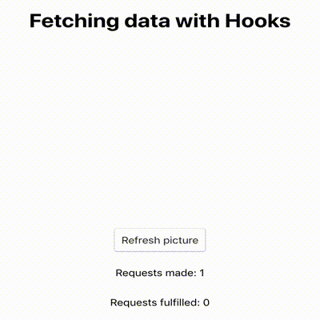

I'm teaching an intro to React workshop on the [CUNY hackathon](https://cunystartups.com/hackathon19/) on Friday 10/18, and I've been working on some [demo code](https://github.com/e-nichols/cuny-react-workshop), which includes a simple component showcasing data fetching with hooks.



Hooks came out in React v16.8 last February. Hooks let you use state and other React features without writing a class. Check out the React blog's [Introducing Hooks](https://reactjs.org/docs/hooks-intro.html) post for more details.

`useState` allows you to add stateful variables to a function component, and `useEffect` combines the class-based `componentDidMount` and `componentDidUpdate` lifecycles into one: it executes code after initial render *and* every update (only if variables in its dependency array update, but more on that later). `useEffect` also plays nice with async functions - yay for data fetching!

Here's the demo code (only 50 lines!):

```js{numberLines:true}
import React, { useState, useEffect, createRef } from 'react'
import './Fetch.css'

/** Fetch random pictures of dogs. */
const Fetch = () => {
  const [isLoading, setIsLoading] = useState(true)
  const [requestsFulfilled, setRequestsFulfilled] = useState(0)
  const [requestsTotal, setRequestsTotal] = useState(1)
  const [url, setUrl] = useState('')

  useEffect(
    () => {
      const fetchPicture = () =>
        fetch(`https://dog.ceo/api/breeds/image/random`)
          .then(response => response.json())
          .then(json => void setUrl(json.message))
      fetchPicture()
    },
    [requestsTotal]
  )

  return (
    <div className="Container">
      <h1>Fetching data with Hooks</h1>
       {
          setIsLoading(false)
          setRequestsFulfilled(requestsFulfilled + 1)
        }}
        src={url}
      />
      <button
        className="Button"
        onClick={() => {
          setRequestsTotal(requestsTotal + 1)
          setIsLoading(true)
        }}
      >
        Refresh picture
      </button>
      <p>Requests made: {requestsTotal}</p>
      <p>Requests fulfilled: {requestsFulfilled}</p>
    </div>
  )
}
```

And the CSS for reference

```
img {
  height: 100%;
}

.Container {
  align-items: center;
  display: flex;
  flex-direction: column;
  min-width: 600px;
  min-height: 600px;
}

.Image {
  height: 300px;
  opacity: 1;
  transition: visibility 0.2s linear,opacity 0.2s linear;
}

.Hidden {
  display: hidden;
  opacity: 0;
}
```

Async data fetching in less than 50 lines! Fabulous!

There are four state variables:

- `url`: persists the result of the API call
- `requestsTotal`: number of API calls made, incremented by pressing the button
- `requestFulfilled`: number of API calls fulfilled
- `isLoading`: whether there is currently a request in-flight

The magic happens in the `useEffect` call. This function executes after initial render and if and only if the `requestsTotal` variable changes, since we pass it in as a dependency to the hook. More on passing a dependency array [here](https://reactjs.org/docs/hooks-effect.html#tip-optimizing-performance-by-skipping-effects).

Our effect here `fetch`es a random dog photo URL, and sets the `url` state variable to it. That url is used as the `src` of the `img` line 25. The `onLoad` handler on line 28 updates the `requestFulfilled` and `isLoading` state.

That's it! Go fetch some data!
