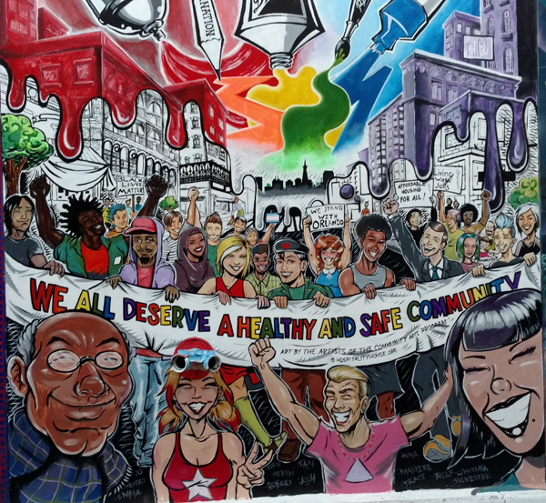

I did a lot of stuff this week. Here are some highlights.

### Day 1

- I have a lovely, patient and wonderful mother. She woke up at 4:00 AM to drive me to KCI for my 6:00 AM flight out to San Francisco the morning of Aug. 15. I slept the entire flight, waking up to the pilot announcing our descent into San Francisco.

- My good friend Jon Volkin picked me up from the airport. Jon worked for Gilead Sciences this summer; I had planned this trip to line up with his final week in the city. He had finished his internship the previous week, leaving us 5 days to explore and enjoy the sites. And for me to do some networking with KU alum and visit a few cool companies HQ'ed here.

- We went to the California Academy of Sciences after a delicious breakfast (I appropriately opted to try out the San Francisco omlette, topped with fresh avocado. It was fuego.) where we explored the aquarium, the indoor rainforest, some incredible nature photography exhibits and the living roof.

- Equipped with some Hell or High Watermelon beer, we spent the evening at Dolores Park. Such a cool place, and incredibly lively for a monday evening.

- Enchiladas at the El Toro Taqueria for dinner. Didn't have to pay extra for the guac. Take notes, Chipotle.

- Walked through the [Clarion Alley](https://en.wikipedia.org/wiki/Clarion_Alley_Mural_Project) on Valencia. A beautiful variety of street art, including a very weird but informative anti-heroin PSA thing and this pro-community piece below:

### Day 2

- Grabbed coffee with Brad Garlinghouse, a KU Alum and active investor in the tech industry here. All things considered, Brad is a badass. He was instrumental in organizing the [KU Tech Trek](http://blog.college.ku.edu/students/tech-trek-connects-jayhawks-to-silicon-valley/), which I participated in its inaugural year. When I initially reached out to him to set up a meeting he got back to me within 5 minutes, happy to set up a time to talk. We talked about tech, my career plans, some startups he is involved with and some project ideas for this coming school year.

- Toured Airbnb HQ with Noah Hendrix and Sally Carmichael, two recent KU graduates. Noah is a Software Engineer and Sally is a Graphic Designer. What do they share in common? They are both awesome people. Two of Airbnb's three co-founders have Industrial Design degrees from RISD, and it definitely shows through in the [beautifully crafted spaces](http://www.wired.com/2013/12/airbnb-gets-stylish-new-headquarters/) on all three floors of the office. Many rooms are inspired from actual Airbnb listings, and many more are inspired by San Francisco landmarks (e.g Dolores Park). I do not exaggerate when I say every nook and cranny of the office is a potential workspace. After the tour we talked about the projects they are both working on and life in the city. Noah gave me some great interview prep advice, and we discussed my coming semester at KU.

- Ate some yummy street tacos.

- Shopped around Haight St. with Jon. Saw the famous Haight/Ashbury intersection; it lived up to it's hippy-culture reputation. I saw a sign in front of one of the stores, "Keep Haight St. Weird." Do not worry, storeowner. It is most definitely weird. Bought some cool socks.

- Enjoyed a classic American meal at Barney's Burgers. Baja Burger, spicy curly fries, Mocha milkshake. Nom.

- Jameson Mule and Anchor Steam at a little Irish pub down the way from Barney's. Talked about [The Library of Babel](https://libraryofbabel.info/), as an offshoot of a discussion about [messages for the future and space shit](https://www.youtube.com/watch?v=GDrBIKOR01c).

### Day 3

- Quick breakfast and gift shopping down in the Noe Valley. Bought a cool Pyramid Building print.

- Did some solo adventuring along Market St. Enjoyed some Blue Bottle iced coffee on the Pier.

- Spent a lazy afternoon at Dolores Park listening to Jon's ["Entertain Me"](https://open.spotify.com/user/1267605225/playlist/6OWsEuLYjihDeIem3OnaJJ) Spotify playlist and drinking some more Hell or High Watermelon.

- Observed a bunch of British tourists playing what I can only describe as a large-scale game of speedball. Two teams of 10-15 people lined up about 20 feet away from each other, with a large water bottle in directly in the center of all participants. Team members would take turns trying to throw a soccer ball at the water bottle -- upon a successful hit the entire team starts drinking until someone from the other team runs to the middle and sets the bottle back up. +1 to the Brits for the innovative way to imbibe as a group.

- Snagged a quick lunch at Dolores Park Cafe. Chicken Pesto sammy.

- Met up with Kelsey's and one of her co-workers at El Techo, an ultra-cool rooftop bar in the Mission. Drank many margaritas, and enjoyed a beautiful view of the skyline.

- Many more drinks at Elbo Room, a cool dive bar. Met a product manager and software engineer for Intuit.

- Fell asleep watching John Oliver on HBO Go.

### Day 4

- Woke up early and drove out to Muir Woods for a morning of hiking. The air is so clear out there. And the trees. They are quite tall. I think they have a reputation for that or something.

- Continued the drive on to Stinson Beach for an afternoon in the sun. Good vibes. Took Highway 1 back to San Francisco, enjoying some killer views on the way.

- Met up with a bunch of Kansas City natives at the Brixton for drinks. Caught up with my friend Marcus Tetwiler who's working at [Wonolo](http://www.wonolo.com/), Zach Colby, Abba and Camille Goehausen and Danielle Norton. Lots of fun.
- Ended the night at the Tipsy Pig.

### Day 5

- My final full day in the city. Great breakfast at La Boulangerie to start the day, picked up some 21st Amendment as a gift for my brother and dad.
- Spent another afternoon in Dolores Park. More good tunes. Perfect weather.
- Helped Jon and Kelsey pack up their car before their 27 hour roadtrip back to Lawrence. They left around 5:30.
- Met up with my good friend and fellow CS student Cole Jurden for a happy hour at the [Thanx](https://www.thanx.com/) offices near the Civic Center. Met lots of cool people. Ben, Sterling, Cristina 1, Cristina 2, Kate, Zach, Dan, Sean -- mostly writing these names for my own memory. Such a cool office.
- Went to Bar None in the Marina, i.e. an adult version of the Jayhawk Cafe Pine Room. I proceeded to get very drunk and stay out very late. Caught an uber back to Oakland with a very sleepy Cole in the wee hours of the morning. Ibuprofen anyone?

### Day 6

- Took the BART to SFO. Tried the Chicken Fries from Burger King. 0/10 would not eat again. Caught my flight home at 5. Nice to sleep in my own bed.
- An eventful and thoroughly exhausting trip. I'm glad I went.
