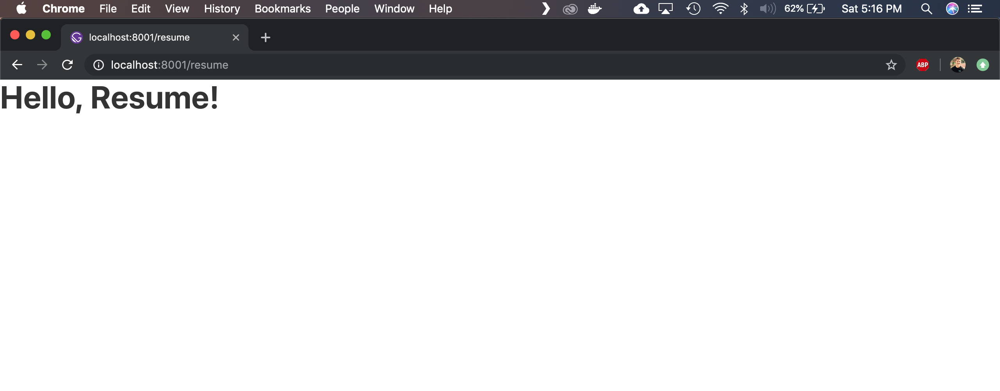

## Overview
This is a mini-tutorial illustrating how to create a simple, responsive resume page for your personal website using Gatsby, React function components and Typescript. It assumes a basic knowledge of these three technologies. If that's not the case, check out these references before getting started:

- [Set up Gatsby development environment](https://www.gatsbyjs.org/tutorial/part-zero/).
- [Typescript in 5 minutes](https://www.typescriptlang.org/docs/handbook/typescript-in-5-minutes.html)
- [Components and Props - React Docs](https://reactjs.org/docs/components-and-props.html)

## Demo
[etnichols.com/resume](http://etnichols.com/resume)

## Set up boilerplate Gatsby site and enable Typescript.

Kick things off by creating a new Gatsby site using the gatsby-cli tool.

```bash
$ gatsby new typescript-resume
```

After the install script finishes, cd into the project directory and run `gatsby-develop` to run the site locally - navigate to `localhost:8000` to check out the site (just boilerplate for now, but not for long!).

Next, install [gatsby-plugin-typescript](https://www.gatsbyjs.org/packages/gatsby-plugin-typescript/). From the project directory, run:

```bash
$ npm i gatsby-plugin-typescript
```

And then, modify your `gatsby-config.js` to include the plugin:

```
module.exports = {
  // ...,
  plugins: [...`gatsby-plugin-typescript`],
}
```

That's it! Now you can use files with a .tsx extension in your project.

## Add resume.tsx to `pages` folder

As the Gatsby docs state, "Any React component defined in `src/pages/*.js` will automatically become a page." With Typescript enabled on the project, that statement can be updated to say, "Any React component defined in `src/pages/*.[js|tsx` will automatically become a page." Note the `.tsx` extension as opposed to just `.ts`. This is because the resume page we create will use JSX, thus we want the `.tsx` extension.

Create a new page at `src/pages/resume.tsx` and copy in this starter code:

```js
import React from 'react'

/** Responsive resume page. */
const Resume = () => (<h1>Hello, Resume!</h1>)

export default Resume
```

Let's see it in action. Run `gatsby develop` again from project directory and navigate your browser to `localhost:8000/resume`. You should see:



You've probably noticed this page isn' actually using Typescript yet 🤔  let's change that.

## Actually use Typescript

## Define types and create data.

## Create function components.

## Compose

## Style

## That's it!
