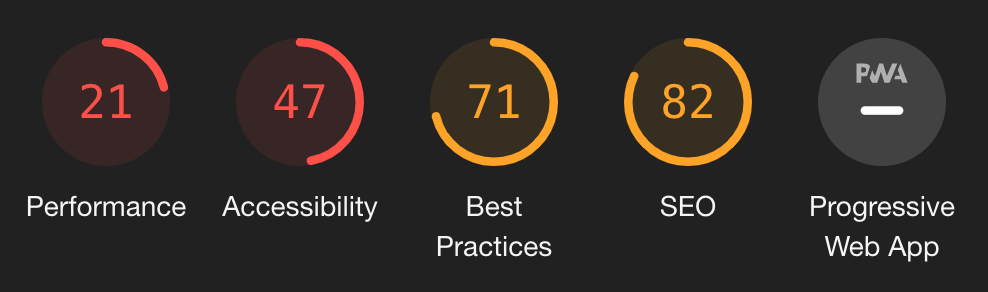

Lead to Read is an awesome non-profit based out of Kansas City that facilitates reading based mentorship in the Kansas City metro area. They connect adult volunteers with 1st-3rd grade students for one hour each week to read together. As their motto goes, "Together we are creating a community of readers, one lunch hour at a time."

It's an awesome organization. But their old website is... less awesome. It's a 10+ year old Wordpress site with less-than-glamorous Lighthouse audit scores:

The performance and accessibility categories are especially concerning: the page takes over 17 seconds to become interactive, and isn't very accessible, or mobile-friendly for that matter.

Ever vigilant for an interesting project, I saw an opportunity here:

- The president of Lead to Read is a close family friend
- I am a shameless Gatsby-fanboy and have read a lot about how it can be an "alternative frontend" to traditional WP sites.

Putting these two things together, I reached out to Pauly Hart and offered to work on a full redesign of the site -- keep the Wordpress as the CMS, but use Gatsby for the frontend.

She agreed, and so the adventure began.

Disclaimer: this post is long and you might find some parts of it boring. I encourage you to skip around to the sections that you find most interesting.

## Motivations for the redesign

- Performance (improve those lighthouse scores!)
- Accessible
- Mobile-friendly
- Simple and easy to understand

## How I approached the design

- Broke out the existing landing page into more coherent sections.
- Worked closely with Martha Conradt to iterate on these sections and the copy.

## Project structure

- Mobile first styling
- One defs to rule them all

## Working with Wordpress - `gatsby-plugin-wordpress`
- normalizer
- routes to include

## Firebase w/ a custom domain
- Really easy.
- But sounds like cloud functions could use some more love. Not efficient. Link to Medium post.
- Is it... worth it?

## Some React tidbits
- OnLoad callback for imgs
